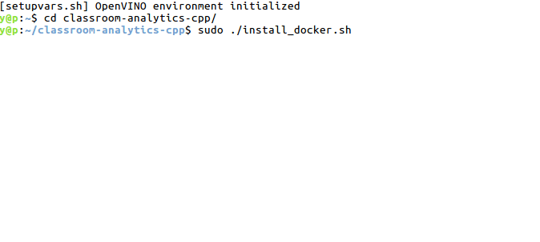
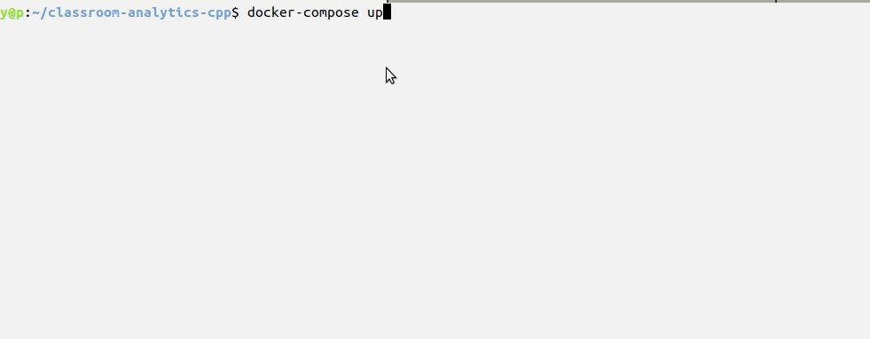
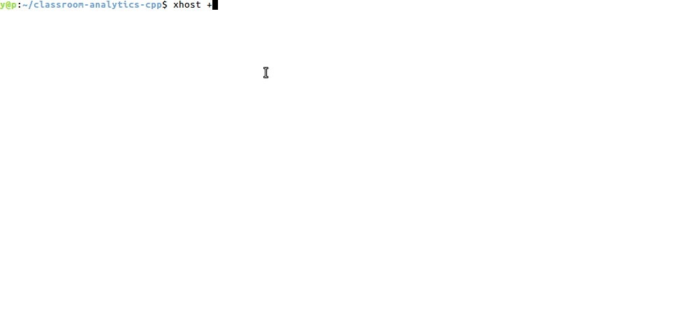
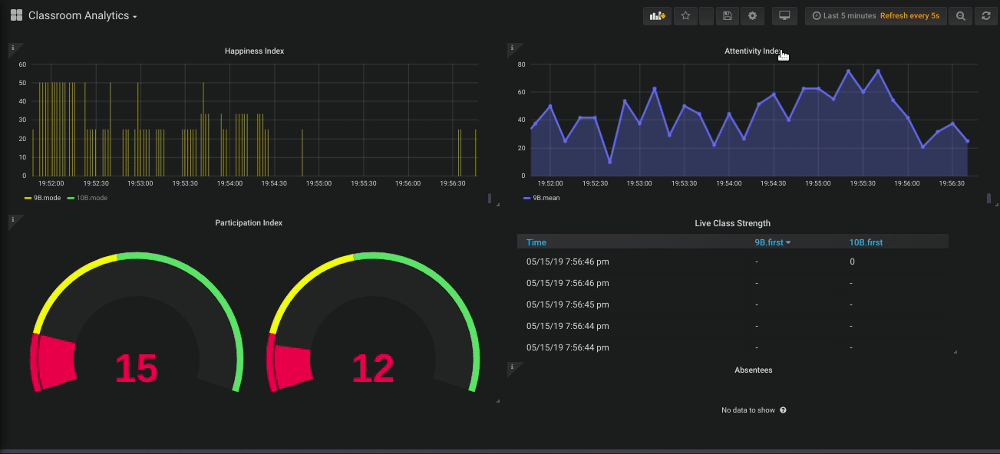

# Intelligent Classroom

| Details            |              |
|-----------------------|---------------|
| Target OS:            |  Ubuntu\* 16.04 LTS   |
| Programming Language: |  C++ |
| Time to Complete:    |  1 hour     |

## Introduction

The aim of Classroom Analytics application is to give feedback to the teachers about the class without interfering with their lecture. The Intelligent Classroom Analytics application monitors the live classroom and provides metrics for Class Attentivity, Class Participation, Happiness Index and also captures automatic attendance.

The data from each classroom can be visualized on Grafana*. The complete solution is deployed as a Docker* containers. We use different containers for each service [ ClassRoom Analytics application, InfluxDB* Datastore, Grafana Visualizations ]


*Fig:1: Grafana Charts for a live classroom*
## Requirements

### Hardware
* 6th to 8th generation Intel® Core™ processor with Iris® Pro graphics or Intel® HD Graphics.

* IP Camera

>If IP camera is not available, use the USB camera as mentioned [here](#testing-with-usb-camera) or use the classroom video file by giving file path as /resources/classroom.mp4

### Software
* [Ubuntu\* 16.04 LTS](http://releases.ubuntu.com/16.04/)<br>
*Note*: We recommend using a 4.14+ Linux* kernel with this software. Run install_4_14_kernel.sh located in /opt/intel/openvino/install_dependencies/ on the host machine. Run the following command to determine your kernel version:

    ```
    uname -a
    ```
* OpenCL™ Runtime Package
* Intel® Distribution of OpenVINO™ toolkit 2019 R2 release
* Docker (18.09.5)
* Docker-compose (1.24.0)
* Git
* InfluxDB (1.7.6)
* Grafana (6.1.6)

## InfluxDB
InfluxDB is a time series database (TSDB) developed by InfluxData. It is written in Go and optimized for fast, high-availability storage and retrieval of time series data in fields such as operations monitoring, application metrics, Internet of Things sensor data, and real-time analytics. It also has support for processing data from Graphite.
Classroom Analytics application uses InfluxDB for storing students data from different classes.

## Grafana
Grafana is a general purpose dashboard and graph composer, which runs as a web application. It supports graphite, InfluxDB or opentsdb as backends.
Classroom Analytics application uses for Grafana for visualizing all the student data metrics from different classes using InfluxDB data base.

## How it works

The Classroom Analytics application uses the Inference Engine included in the Intel® Distribution of OpenVINO™ toolkit. The application shows an example of joint usage of several neural networks to detect the following metrics from a live classroom:

- **Attentivity Index**: Captures the overall Attentivity of the students in the classroom. The students looking at the front towards the teacher/BlackBoard, taking notes, reading or writing is marked as attentive in the class. To calculate this metric, it uses `head-pose-estimation-adas-0001` to get the value of the head pose of each student and calculate the mean.

- **Participation Index**: Captures the real-time class participation ie: students standing for answering a query, raising a hand for asking a query. To calculate the metric it uses `person-detection-action-recognition-0005`, for finding persons and simultaneously predicting their current actions like sitting/standing/hand-raising.

- **Happiness Index** - Uses `emotions-recognition-retail-0003` pre-trained model to detect the average emotions of the students and calculate the real-time Happiness of the classroom.

- **Automatic Attendance** - Captures the total strength of the class and absentees during the class. Uses `face-reidentification-retail-0095` pre-trained model to detect the individual faces in the Classroom.


*Fig:2: Architecture Diagram for the Reference Implementation*

The Classroom Analytics application can be deployed as a Docker container for each classroom. On the start-up, the application reads command line parameters and loads six models to the Inference Engine. Using these networks the application does inference on the frames and create quantitative metrics for the user. The metrics from each classroom are collected in an InfluxDB Datastore container and are visualized using Grafana container.


### Download the repo

Download the repository or do a git clone of the repository.

>If git is not installed in the host system, Install it using: "sudo apt-get update && apt-get install git" command.

### Pre-requisites

1. Adding gallery for the students for the Classroom Attendance:-
    To recognize faces on a frame, the Classroom Analytics application needs a gallery of reference images. Add the frontal-oriented faces of student faces in the students folder inside the cloned folder. Each student can have multiple images. The images should be named as id_name.png, ...

    >The files are located at : resources/

2. Adding the classroom timetable. The entries for the classroom can be configured in timetable.txt file.
    >The file is located at :classroom_analytics/timetable.txt


### Install dependencies

The Classroom Analytics application depends on a few software packages [ docker and docker-compose] on the vanilla Ubuntu system. To install the dependencies, open the terminal, cd into the cloned repository and run the following commands:-

Run the script to download and install the software packages.

>If the cloned/downloaded files are not executable, add executable permission by _"chmod +x install_docker.sh"_

```console
cd intelligent-classroom
sudo ./install_docker.sh
 ```



*Fig:3: Running the installer script on the host*

Once the installation is complete, the Docker service will start automatically. This can be verified by typing:

```console
 sudo systemctl status docker
```

The output will look something like this:
```console
docker.service - Docker Application Container Engine
   Loaded: loaded (/lib/systemd/system/docker.service; enabled; vendor preset: enabled)
   Active: active (running) since Mon 2019-04-18 01:22:00 PDT; 6min ago
     Docs: https://docs.docker.com
 Main PID: 10647 (dockerd)
    Tasks: 21
   CGroup: /system.slice/docker.service
```

Test docker-compose installation.

```console
sudo docker-compose --version

docker-compose version 1.24.0, build 1110ad01
```

#### Automation script for setup and run the application

If you are using the Classroom Analytics application for the first time, run the launch script provided in the folder after completing the prerequisites and install dependencies. The script takes care of building, installing, creating and running the containers for a single classroom.

```console
sudo ./launch.sh

```
There are a few flags that can be set while running the script (Optional)
```console
sudo ./launch.sh -h

script usage: $(launch.sh) [-r Classroom Name] [-c Ip Camera Link] [-i InfluxDB Ip]
```
Example:

```console
sudo ./launch.sh -r 9B -i 172.21.0.6

```
Note: The default static ip of the InfluxDB container is set to 172.21.0.6
It is used to make connection establishment with Grafana.

To see the Classroom Analytics application charts, follow the steps mentioned [here](#configure-grafana-for-visualizations)

### Configure Grafana* for Visualizations

* Open a browser on the host computer, go to http://localhost:3000. (You will get change password prompt while logging into grafana. Skip it.)

* Login with the default credentials as user : **admin** and password : **admin**.

* Click on the Configuration icon present on the left panel.

* Click on + Add data source button and provide the inputs below.

* Add data source from the InfluxDB container:

  * Type: InfluxDB
  * Name: InfluxDB
  * URL: http://(influxDBContainerIpaddress/172.21.0.6):8086
  * Database: Analytics
  * Click on “Save and Test”

>Default IP of influx Container : 172.21.0.6


*Fig:7: Adding InfluxDB Datastore in Grafana*

* Import the intelligent-classroom/resources/Grafana.json from the Grafana import dashboards.


*Fig:8: Adding a sample dashboard in Grafana*

* Monitor the live metrics from the pre-configured Grafana dashboard.


*Fig:9: Live data charts from the ClassRoom*

>In case you see no data in the Charts, over the widget name(Happiness Index etc) select edit option in every widget and change the classroom name as per your classroom.
---

#### Running on the integrated Intel Processor Graphics (GPU) (optional)

By default, the application runs on the CPU. User can specify which models to run on GPU by using the flags specified.

#### Running on the  Intel® Movidius™ VPU(optional)

By default, the application runs on the CPU. User can specify which models to run on  Intel® Movidius™ VPU by using the HDDL flags specified.

Note : If you want to run inference on  Intel® Movidius™ VPU device you'll need an FP16 version of the model.

Models which are supported:

1. Action_Recognition - person-detection-action-recognition-0005.xml
2. Face_Detection - face-detection-adas-0001.xml
3. Head_Pose - head-pose-estimation-adas-0001.xml
4. Emotions_Recognition - emotions-recognition-retail-0003.xml

Models which are not supported:

1. Face_reidentification - face-reidentification-retail-0095.xml
2. Landmarks_Regression - landmarks-regression-retail-0009.xml

Steps for running with  Intel® Movidius™ VPU plugin
1. Install OpenVINO using this link https://docs.openvinotoolkit.org/2019_R3/_docs_install_guides_installing_openvino_linux.html
2. Intel® Movidius™ VPU drivers should be installed on host machine
Note : follow the below link to install same on host machine
https://docs.openvinotoolkit.org/latest/_docs_install_guides_installing_openvino_linux_ivad_vpu.html

3. Enable or uncomment the flag devices: "- /dev/ion:/dev/ion" (line number:39) from docker-compose.yml file which is under cloned directory.

4. Run hddldaemon on the host in a separate terminal session using the following command:
source /opt/intel/openvino/bin/setupvars.sh && $HDDL_INSTALL_DIR/bin/hddldaemon

5. Change the executable in launch script as per below:

docker exec -it "$containerId" /bin/bash -c "source /opt/intel/openvino/bin/setupvars.sh && \
/root/inference_engine_samples_build/intel64/Release/classroom-analytics \
-pdc=/resources/intel/person-detection-action-recognition-0005/FP16/person-detection-action-recognition-0005.xml \
-c=/resources/intel/face-detection-adas-0001/FP16/face-detection-adas-0001.xml \
-lrc=/resources/intel/landmarks-regression-retail-0009/FP32/landmarks-regression-retail-0009.xml \
-pc=/resources/intel/head-pose-estimation-adas-0001/FP16/head-pose-estimation-adas-0001.xml \
-sc=/resources/intel/emotions-recognition-retail-0003/FP16/emotions-recognition-retail-0003.xml \
-frc=/resources/intel/face-reidentification-retail-0095/FP32/face-reidentification-retail-0095.xml \
-fgp=/opt/intel/openvino/inference_engine/samples/classroom_analytics/faces_gallery.json \
-i=\"$camera\" --influxip=$influxIp --cs=$classroom -d_fd=HDDL -d_hp=HDDL -d_em=HDDL -d_act=HDDL"

#### Running on the  Intel® Movidius™ Neural Compute Stick(optional)

By default, the application runs on the CPU. User can specify which models to run on  Intel® Movidius™ Neural Compute Stick by using the flags specified.

Note : If you want to run inference on  Intel® Movidius™ Neural Compute Stick device you'll need an FP16 version of the model.

Models which are supported:

1. Action_Recognition - person-detection-action-recognition-0005.xml
2. Face_Detection - face-detection-adas-0001.xml
3. Head_Pose - head-pose-estimation-adas-0001.xml
4. Emotions_Recognition - emotions-recognition-retail-0003.xml

Models which are not supported:

1. Face_reidentification - face-reidentification-retail-0095.xml
2. Landmarks_Regression - landmarks-regression-retail-0009.xml

Steps for running with Intel® Movidius™ Neural Compute Stick plugin

1. Run the command manually

```console
sudo docker run --network=host --env="DISPLAY" --volume="$HOME/.Xauthority:/root.Xauthority:rw" -it --privileged -v /dev:/dev classroom-analytics

```
2. Run the below executable in which user can specify the models to run on  Intel® Movidius™ Neural Compute Stick by using the flags specified.

```console
cd root/inference_engine_samples_build/intel64/Release/
source /opt/intel/openvino/bin/setupvars.sh

./classroom-analytics -pdc=/resources/intel/person-detection-action-recognition-0005/FP16/person-detection-action-recognition-0005.xml -c=/resources/intel/face-detection-adas-0001/FP16/face-detection-adas-0001.xml -lrc=/resources/intel/landmarks-regression-retail-0009/FP32/landmarks-regression-retail-0009.xml -pc=/resources/intel/head-pose-estimation-adas-0001/FP16/head-pose-estimation-adas-0001.xml -sc=/resources/intel/emotions-recognition-retail-0003/FP16/emotions-recognition-retail-0003.xml -frc=/resources/intel/face-reidentification-retail-0095/FP32/face-reidentification-retail-0095.xml -fgp=/opt/intel/openvino/inference_engine/samples/classroom_analytics/faces_gallery.json -i=/resources/classroom.mp4 --influxip=172.21.0.6 --cs=9B -d_fd=MYRIAD -d_hp=MYRIAD -d_em=MYRIAD -d_act=MYRIAD

```
>If there is an error in viewing the GUI, run **xhost +SI:localuser:root** before logging into the container.

### Run Containers manually(Optional)

- Run the following command from inside the cloned folder.

```console
cd intelligent-classroom
sudo docker-compose up
```
The above command creates 3 containers from the images, create bridge networks and assign IP addresses, establishes connectivity between the containers and add persistent storage.

Now open a new terminal to log into the containers and start the application.

>You can also run "docker-compose up -d" to run the containers in the background.


*Fig:5: Running Containers via Docker Compose*

### Manual procedure for setup the environment and run the application(Optional)

### Setup the environment

Once we have installed all the dependencies, we will proceed with building the containers for the Classroom-analytics, InfluxDB, Grafana.

Note : Download the latest [OpenVINO R3](https://software.intel.com/en-us/openvino-toolkit/choose-download) release and copy the downloaded .tgz file to the cloned directory
Run the following command from the cloned folder.

```console
sudo ./setup.sh
```
The setup.sh script does the following tasks:-

* Builds the classroom-analytics Docker image.
* Download/Install Dependencies in the image
* Install the required pre-trained models.
* Creates faces_gallery file.
* Set necessary Environment variables.
* Pull and creates Grafana and InfluxDB container images.

Once the setup.sh script execution completed then we should see three Docker images:

```console
sudo docker images
```


### Run the application

To start the Classroom Analytics application we have to follow below steps.

- Open new terminal and go the cloned directory(Classroom Analytics application)
```console
cd intelligent-classroom

- To get the Container ID of your running container, use the following commands

sudo docker-compose up
sudo docker ps -aqf "name=classroom-analytics"
Exp:92de4bfxxxxx
```

- Before logging into the container, run '**xhost +**' in the host terminal to give GUI access to the container.

- Login to the containers using the command
```console
sudo docker exec -it <container ID> /bin/bash
```

- Important flags to use while running the application

```console
--cs, --section (value:DEFAULT)
        specify the class section
--d_act, --device (value:CPU)
          Optional. Specify the target device for Person/Action Detection Retail (CPU, GPU, HDDL).
--d_em, --device (value:CPU)
          Optional. Specify the target device for Emotions Retail (CPU, GPU, HDDL).
--d_fd, --device (value:CPU)
          Optional. Specify the target device for Face Detection Retail (CPU, GPU, HDDL).
--d_hp, --device (value:CPU)
          Optional. Specify the target device for Headpose Retail (CPU, GPU, HDDL).
--d_lm, --device (value:CPU)
          Optional. Specify the target device for Landmarks Regression Retail (CPU, GPU, HDDL).
--d_reid, --device (value:CPU)
          Optional. Specify the target device for Face Reidentification Retail (CPU, GPU, HDDL).
--db_ip, --influxip (value:172.21.0.6)
        specify the Ip Address of the InfluxDB container
-h, --help (value:true)
        Print help message.
-i, --input
        Path to input image or video file.
--no-show, --noshow (value:0)
        specify no-show = 1 if don't want to see the processed Video
```

- Run the Classroom Analytics application with relevant attributes in the flags. ie: Class Section, Ip camera etc.

```console

cd root/inference_engine_samples_build/intel64/Release/

source /opt/intel/openvino/bin/setupvars.sh

./classroom-analytics -pdc=/resources/intel/person-detection-action-recognition-0005/FP32/person-detection-action-recognition-0005.xml -c=/resources/intel/face-detection-adas-0001/FP32/face-detection-adas-0001.xml -lrc=/resources/intel/landmarks-regression-retail-0009/FP32/landmarks-regression-retail-0009.xml -pc=/resources/intel/head-pose-estimation-adas-0001/FP32/head-pose-estimation-adas-0001.xml -sc=/resources/intel/emotions-recognition-retail-0003/FP32/emotions-recognition-retail-0003.xml -frc=/resources/intel/face-reidentification-retail-0095/FP32/face-reidentification-retail-0095.xml -fgp=/opt/intel/openvino/inference_engine/samples/classroom_analytics/faces_gallery.json -i=<Ip Of the Ip Camera/Location of video File (/resources/classroom.mp4)/ cam> --influxip=<Ip of InfluxDB Container/172.21.0.6> --cs=9B
```
>The default static ip of the InfluxDB container is set to 172.21.0.6


*Fig:6: Running the classroom analytics application*

>If there is an error in viewing the GUI, run **xhost +SI:localuser:root** before logging into the container.


>Default IP of influx Container : 172.21.0.6


*Fig:7: Adding InfluxDB Datastore in Grafana*

* Import the Grafana.json from the Grafana import dashboards.


*Fig:8: Adding a sample dashboard in Grafana*

* Monitor the live metrics from the pre-configured Grafana dashboard.


*Fig:9: Live data charts from the ClassRoom*

>In case you see no data in the Charts, over the widget name(Happiness Index etc) select edit option in every widget and change the classroom name as per your classroom.
---

## Additional Steps (Optional)

#### Adding more classrooms

With our current approach, we can add more classrooms and gather their live data as well for visualization and analytics of the defined metrics.


*Fig:10:Multiple Classes means Multiple containers*

To scale the application for multiple classrooms we can create multiple containers using the following command.
```console
cd intelligent-classroom
sudo docker-compose up --scale classroom-analytics=<N>
Note: N=2 or 3 etc..
```


*Fig:11: Running Compose command for supporting multiple Classrooms*

This will create N container instances of the classroom-analytics image. We can log into each container and run the command mentioned in the above steps to get the data from the particular classroom.

To get the Container IDs of your running containers, use the following command

```console
sudo docker ps -aqf "name=classroom-analytics"
Exp:
92de4bfxxxxx
58dba92xxxxx
```

Login to the containers in different terminals using the following command:-

```console
sudo docker exec -it <container ID> /bin/bash
```
Once we are at the container console, execute the command for running the application as mentioned above. The --i IP Camera stream and --cs (section) flag input needs to be changed as per the new classrooms being added.

For Example, let's say we have two classrooms namely 9B and 10B. We run the following commands after logging into the containers in two different terminals.

- Classroom 1 : Name = 9B

```console
cd root/inference_engine_samples_build/intel64/Release/
source /opt/intel/openvino/bin/setupvars.sh

./classroom-analytics -pdc=/resources/intel/person-detection-action-recognition-0005/FP32/person-detection-action-recognition-0005.xml -c=/resources/intel/face-detection-adas-0001/FP32/face-detection-adas-0001.xml -lrc=/resources/intel/landmarks-regression-retail-0009/FP32/landmarks-regression-retail-0009.xml -pc=/resources/intel/head-pose-estimation-adas-0001/FP32/head-pose-estimation-adas-0001.xml -sc=/resources/intel/emotions-recognition-retail-0003/FP32/emotions-recognition-retail-0003.xml -frc=/resources/intel/face-reidentification-retail-0095/FP32/face-reidentification-retail-0095.xml -fgp=/opt/intel/openvino/inference_engine/samples/classroom_analytics/faces_gallery.json -i=<Ip Of the Ip Camera/Location of video File (/resources/classroom.mp4)/ cam> --influxip=<Ip of InfluxDB Container/172.21.0.6> --noshow=1 --cs=9B
```

- Classroom 2 : Name = 10B

```console
cd root/inference_engine_samples_build/intel64/Release/
source /opt/intel/openvino/bin/setupvars.sh

./classroom-analytics -pdc=/resources/intel/person-detection-action-recognition-0005/FP32/person-detection-action-recognition-0005.xml -c=/resources/intel/face-detection-adas-0001/FP32/face-detection-adas-0001.xml -lrc=/resources/intel/landmarks-regression-retail-0009/FP32/landmarks-regression-retail-0009.xml -pc=/resources/intel/head-pose-estimation-adas-0001/FP32/head-pose-estimation-adas-0001.xml -sc=/resources/intel/emotions-recognition-retail-0003/FP32/emotions-recognition-retail-0003.xml -frc=/resources/intel/face-reidentification-retail-0095/FP32/face-reidentification-retail-0095.xml -fgp=/opt/intel/openvino/inference_engine/samples/classroom_analytics/faces_gallery.json -i=<Ip Of the Ip Camera/Location of video File (/resources/classroom.mp4)/ cam> --influxip=<Ip of InfluxDB Container/172.21.0.6> --noshow=1 --cs=10B
```
Note : Modify resources/Grafana.json file as per class section(--cs) default it is 9B.

In Grafana, import the same **Grafana.json** file and change the classroom name as per the one given in the application flags by editing individual panels in the Dashboard. To edit the panels click on the panel name and select Edit from the drop-down menu. Save the changes when you are done.


*Fig:12: Adding more classes in Grafana*

#### Testing with USB Camera

To test with a USB Camera attach the Camera to the USB port of the host machine.

While running the application, use _-i=cam_ as the option to use the video from the USB camera.

>When running Docker compose for multiple classrooms containers, the camera will be accessible only for one container


##### NOTES

>With additional classroom containers being run simultaneously the overall inference rate will drop.

>Attendance is calculated in the half-time of the class ie: if the class starts from 10 am in timetable.txt. Attendance for that subject will be calculated at 10:30 am.

>The overall accuracy of the inference depends on the individual model resolution and accuracy of the model. To learn more, visit  [Overview of OpenVINO™ Toolkit Pre-Trained Models](https://docs.openvinotoolkit.org/latest/_docs_Pre_Trained_Models.html).

#### Troubleshooting

If launch.sh script is failed with the following error

	Error : Pool overlaps with other one on this address space

go to the cloned directory(intelligent-classroom) then run the below command

	docker-compose down